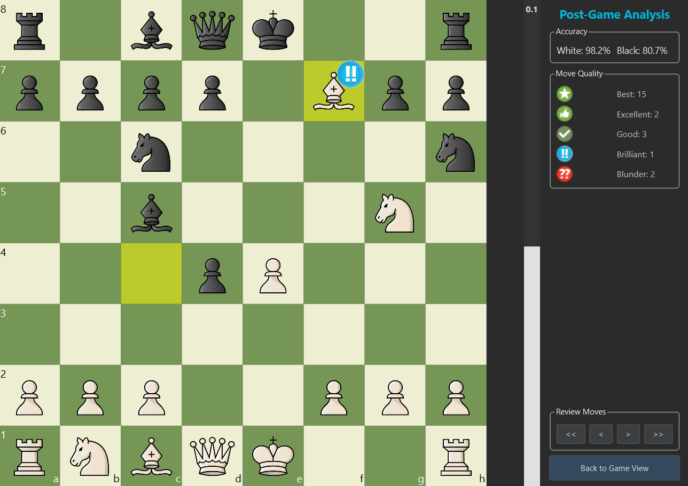

# Chess - Advanced Chess Analysis GUI



A powerful, modern Chess GUI built with **Python** and **PyQt6**, featuring integrated Stockfish analysis, dynamic evaluation visualization, and advanced move classification.

## ✨ Features

- **Game Modes**:
  - ♟️ **PvP**: Player vs Player (Local).
  - 🤖 **PvE**: Player vs Engine (Adjustable Difficulty Levels 1-8).
  - ⚔️ **EvE**: Engine vs Engine (Watch Stockfish play against itself).
- **Advanced Post-Game Analysis**:
  - Full game review with move-by-move evaluation.
  - **Move Classification**: Detects **Brilliant (!!)**, **Great (!)**, **Best**, **mistakes(?)**, and **blunders(??)**.
  - **Forced Move Detection**: Automatically identifies when you had only one legal move.
  - **Visual Feedback**: Dynamic Evaluation Bar (White/Black advantage) and Best Move Arrows.
- **Modern Interface**:
  - Dark Theme with polished UI components.
  - Smooth animations and responsive layout.
  - PGN History Navigation.

## 🚀 Installation

1. **Clone the Repository**:
   ```bash
   git clone https://github.com/yourusername/scacchi.git
   cd scacchi
   ```

2. **Install Dependencies**:
   ```bash
   pip install -r requirements.txt
   ```
   *Requires `PyQt6` and `python-chess`.*

3. **Stockfish Engine**:
   - Ensure the Stockfish executable is placed in the `engine/` directory.
   - Default path expected: `src/engine/stockfish.exe`.
   - *Note: You can configure the engine path in `src/model/engine_thread.py` if needed.*

## 🎮 Usage

Run the main application:

```bash
python main.py
```

### Controls
- **Analyze Game**: After a game ends, click "Analyze Game" to start the engine review.
- **Navigation**: Use the dashboard buttons to step through moves. The Eval Bar and Board will update automatically.
- **Theme**: Click the "Theme" button to change board colors.

## 🛠️ Technologies

- **Language**: Python 3.10+
- **GUI Framework**: PyQt6
- **Chess Logic**: python-chess
- **Engine**: Stockfish (UCI Protocol)

## 📄 License

This project is licensed under the MIT License - see the [LICENSE](LICENSE) file for details.
